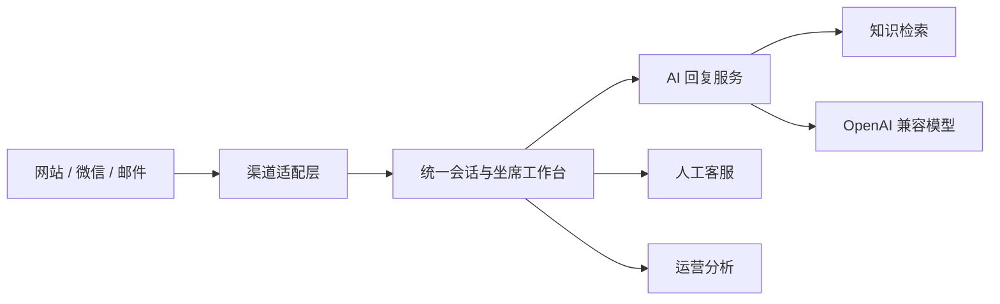

# 系统架构

## 当前范围

当前仓库交付的是一套可运行的 AI 客服 MVP，覆盖统一会话工作台、人工接管、知识库、AI 回复建议、运营分析、渠道配置、团队路由和系统设置。

## 模块边界

- `src/app/(workspace)`：工作台页面和路由。
- `src/components/inbox`：会话队列、消息流、客户资料和人工接管。
- `src/components/knowledge`：知识维护与检索测试。
- `src/components/ai`：客服回复助手。
- `src/components/operations`：渠道、团队和系统配置。
- `src/app/api/ai/suggest`：AI SDK 6 流式回复接口。
- `src/lib/ai/provider.ts`：OpenAI 兼容模型适配器。
- `src/lib/knowledge-data.ts`：演示检索内核；后续可替换为 RAGFlow、FastGPT 或向量数据库。

## 生产化替换点

1. 将演示数据替换为 PostgreSQL，并给联系人、会话、消息、知识和审计日志建立租户隔离。
2. 将本地关键词检索替换为 FastGPT/RAGFlow API 或 pgvector 混合检索。
3. 通过 Chatwoot Webhook/API 或自建渠道网关接入真实消息。
4. 对 Webhook 加签名验证、幂等键、重试队列和死信处理。
5. 接入组织级认证、RBAC、密钥托管、审计日志和数据保留策略。

## AI 安全策略

- 模型只能引用已发布知识。
- 资料不足时拒绝猜测并建议人工核实。
- 退款、合同、账户安全和具体赔付必须人工确认。
- 浏览器不保存模型密钥，密钥只通过服务端环境变量注入。
