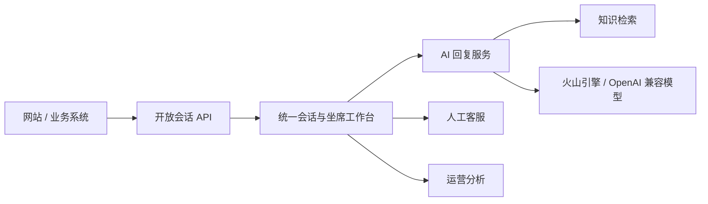

# 系统架构

## 当前范围

当前仓库交付的是一套可运行的 AI 客服系统，覆盖统一会话工作台、知识库、AI 回复建议、运营分析、开放 API、真实团队状态和运行时设置。

## 模块边界

- `src/app/(workspace)`：工作台页面和路由。
- `src/components/inbox`：会话队列、消息流、客户资料和人工接管。
- `src/components/knowledge`：知识维护与检索测试。
- `src/components/ai`：客服回复助手。
- `src/components/operations`：渠道、团队和系统配置。
- `src/app/api/ai/suggest`：AI SDK 6 流式回复接口。
- `src/app/api/conversations`：会话、状态和消息写入 API。
- `src/db/schema.ts`：PostgreSQL 多租户数据模型。
- `src/lib/conversations`：PostgreSQL 会话仓储与输入校验。
- `src/lib/auth`：自托管认证、租户上下文与角色权限。
- `src/app/api/auth`：Better Auth 登录和会话接口。
- `src/lib/ai/provider.ts`：OpenAI 兼容模型适配器。
- `src/lib/settings`：组织级运行配置、验证和敏感密钥加密。
- `src/app/api/settings`：受 RBAC 保护的运行时配置与连接测试接口。
- `src/lib/knowledge`：PostgreSQL 知识仓储、发布工作流与中文检索内核。

## 当前生产边界

1. 联系人、会话、消息、订单、知识、团队容量与运行配置均由 PostgreSQL 持久化；基础数据使用明确标签区分。
2. 文档规模增长后，将当前中文关键词检索升级为 FastGPT/RAGFlow API 或 pgvector 混合检索。
3. 当前正式入站能力是 `/api/v1` 开放 API；微信、邮件和 Chatwoot 原生连接器尚未实现，不显示为已连接。
4. 对 Webhook 加签名验证、幂等键、重试队列和死信处理。
5. 组织级认证和 RBAC 已接入；仍需登录审计、SSO 和数据保留策略。

## AI 安全策略

- 模型只能引用已发布知识。
- 资料不足时拒绝猜测并建议人工核实。
- 退款、合同、账户安全和具体赔付必须人工确认。
- 浏览器不保存或读取模型密钥，密钥由服务端加密后按组织存入 PostgreSQL。
